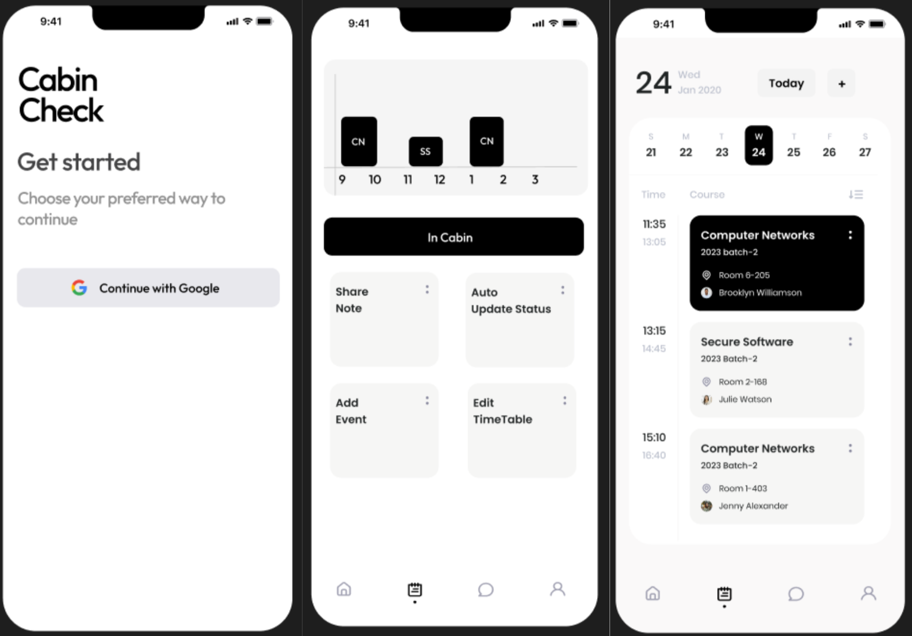
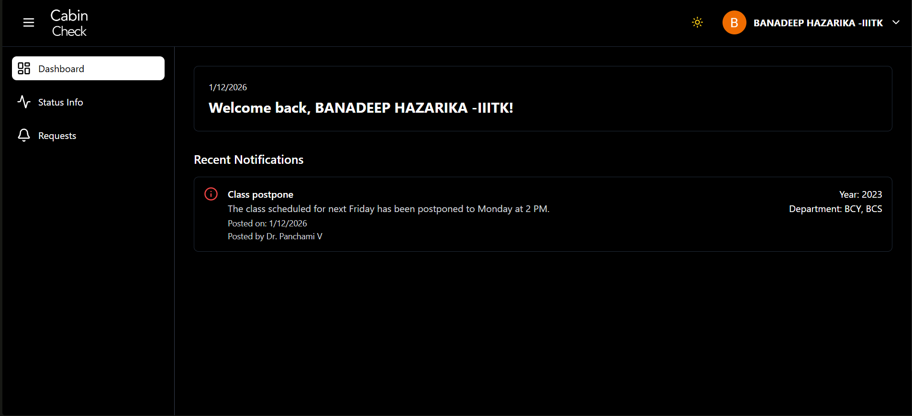
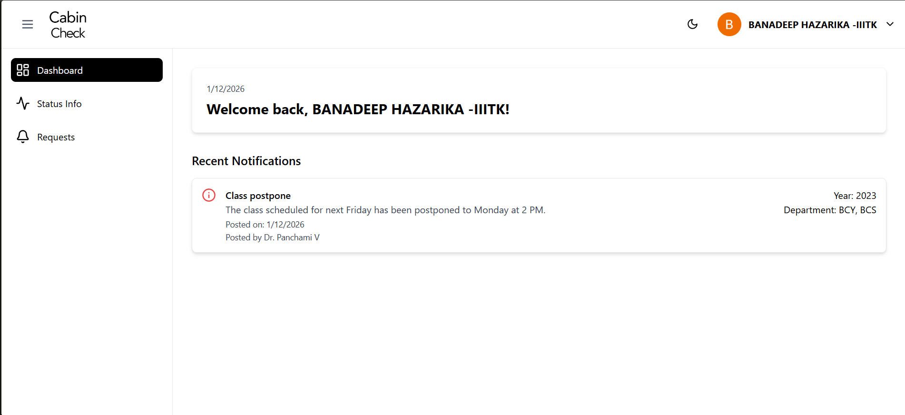
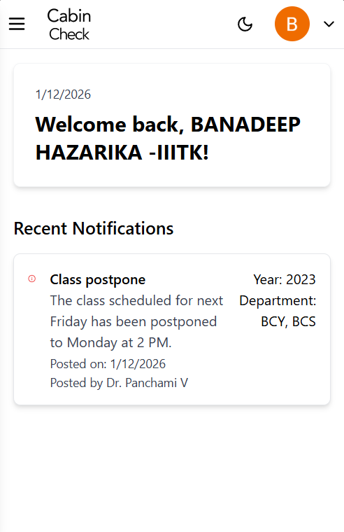
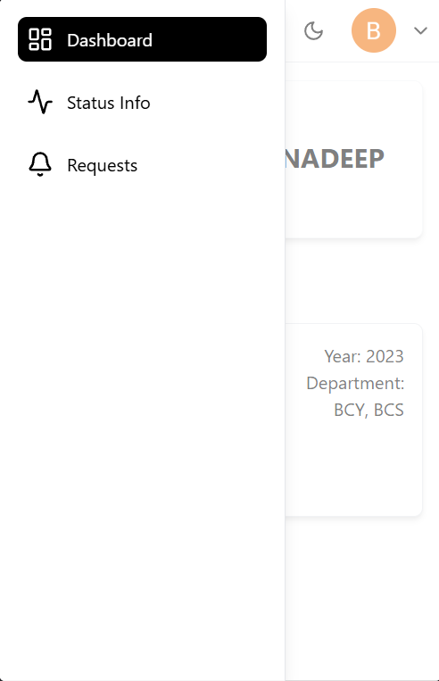
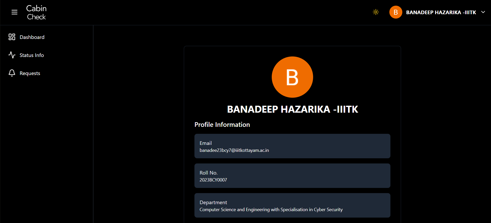
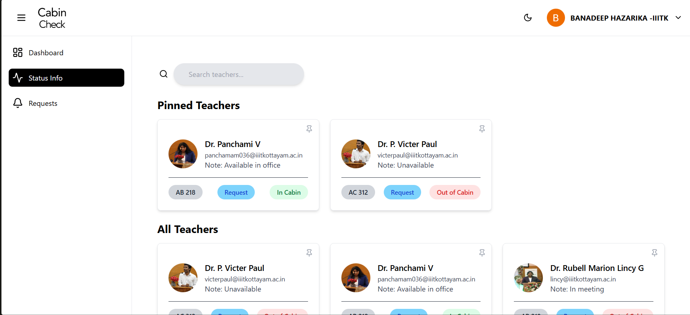
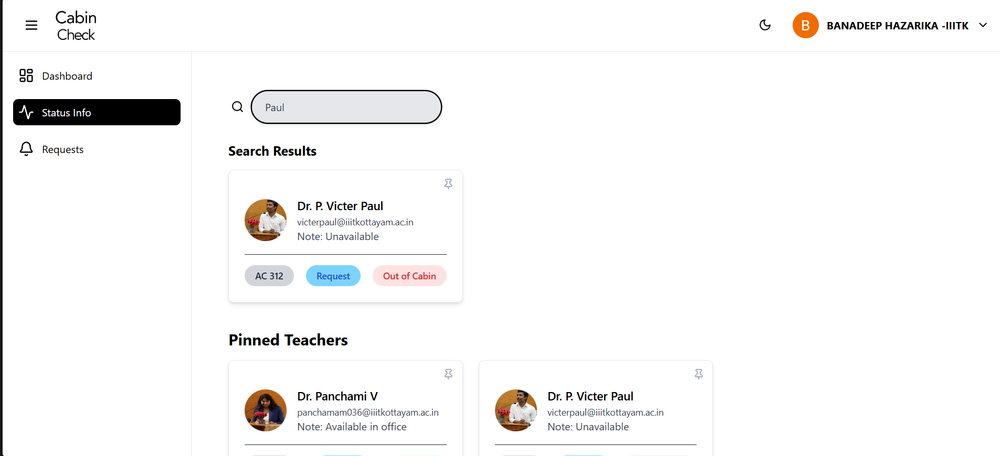
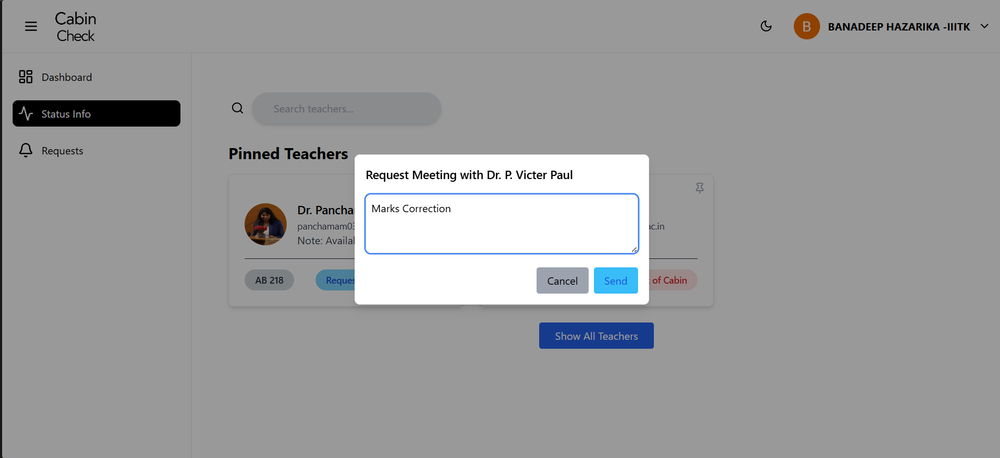
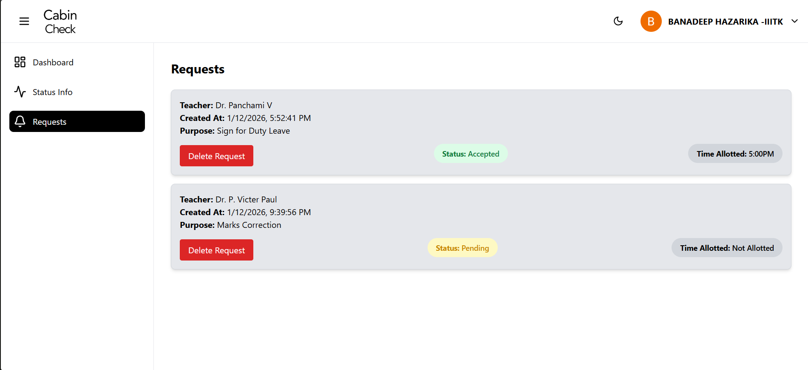

# Cabin Check

**Cabin Check** is a campus communication platform designed to help students quickly locate professors and view their real-time cabin availability. The system streamlines meeting requests, notifications, and availability updates, improving overall academic coordination.

The platform supports:
- Real-time professor availability tracking.
- Student-to-professor meeting requests with approval and scheduling.
- Broadcast notifications from professors to specific years or batches.
- Push notification to app when new meeting is requested.
Cabin Check is built as a cross-platform system, with a web interface for students and a mobile application for professors.

## Tech Stack

**Frontend**
- React (Web – Students)
- Flutter (Android App – Professors)

**Backend**
- Node.js
- Express.js

**Database**
- MongoDB Atlas


## Screenshots

**Flutter App**

<p align="center">

  

</p>

**Dashboard with dark and light mode**
<p align="center">
  
  
</p>
<b>Adjusted UI and for mobile device</b>
<p align="center">
  
  
</p>
<b>Profile Page with Year and Department auto adjusted from college email</b>
<p align="center">
  
</p>
<b>Status Page with Searching and Requesting meeting function</b>
<p align="center">
  
  
  
</p>
<b>Meeting Request Page</b>
<p align="center">
  
</p>

## Installation

### Website(Student)

1. Run `npm install` to install dependencies

2. Create an environment file:
- Rename env to .env
- Set MONGO_URI and VITE_BASE_URL to your IPv4 address(optional) in .env

3. Run `npm run dev` to start development server.

### App (Teacher)

**Important:** Ensure the backend server is running `npm run dev` before launching the app..

**Prerequisites**
<ul>
  <li>Flutter SDK</li>
  <li>Java JDK</li>
  <li>Android SDK (command-line tools for abd method or via Android Studio)</li>
  <li>USB Debugging enabled on your Android device</li>
  <li>`adb` added to your system PATH (comes with Android SDK's platform-tools)</li>
</ul>

**ADB Method**

1. Connect Android Phone and enable USB Debugging(Verify connection using `adb devices` or `flutter devices`)

2. Run `flutter clean` and `flutter pub get` in project folder.

3. Build or run APK using `flutter build apk --debug` or `flutter run`

**Known Issue:** It might throw error stating build not found since flutter searches for the APK in `build/app/outputs/flutter-apk/` but the APK was generated in `android/app/build/outputs/apk/debug/app-debug.apk`. If it occurs, copy the apk to the expected directory and run `flutter run` again.

**Android Studio Method**

1. Open project folder in Android Studio.

2. Either start an emulator from AVD Manager or connect your Android phone with USB Debugging enabled.

3. Click the green Run button (or Shift + F10). Android Studio will build the app and install it to the selected device

## Backend Benchmark Results

The Cabin Check backend was load-tested using **k6** to measure API throughput, latency, and system stability under concurrent authenticated traffic.

Tests targeted a protected student endpoint with **Firebase Authentication enabled**, simulating real-world usage.

---

## Stable Load Test

**Concurrent Users:** 150  
**Test Duration:** ~3.5 minutes  
**Authentication:** Enabled (Firebase JWT verification)

| Metric | Result |
|------|------|
| Requests/sec | **~68 RPS** |
| Total Requests | **14,367** |
| Error Rate | **0%** |
| Average Latency | **1.41s** |
| Median Latency | **1.06s** |
| p95 Latency | **2.03s** |

The system maintained **stable performance with no request failures** during sustained authenticated load.

---

## Stress Test

**Concurrent Users:** 600  
**Test Duration:** ~3.5 minutes

| Metric | Result |
|------|------|
| Requests/sec | **~70 RPS** |
| Total Requests | **14,866** |
| Error Rate | **0%** |
| Average Latency | **4.93s** |
| p95 Latency | **8.03s** |

Even at extreme concurrency levels, the backend remained **stable with no crashes or failed requests**, though latency increased due to request queueing.

---

## Key Takeaways

- Backend sustains **~70 authenticated requests/sec**
- System remained **100% stable during load and stress testing**
- Successfully handled **150 concurrent users under sustained load**
- Stress-tested up to **600 concurrent users** without failures

---

## Benchmarking Tool

Load testing performed using **k6**.

Example configuration:

```javascript
export const options = {
  stages: [
    { duration: '30s', target: 75 },
    { duration: '1m', target: 75 },
    { duration: '30s', target: 150 },
    { duration: '1m', target: 150 },
    { duration: '30s', target: 0 },
  ],
};
